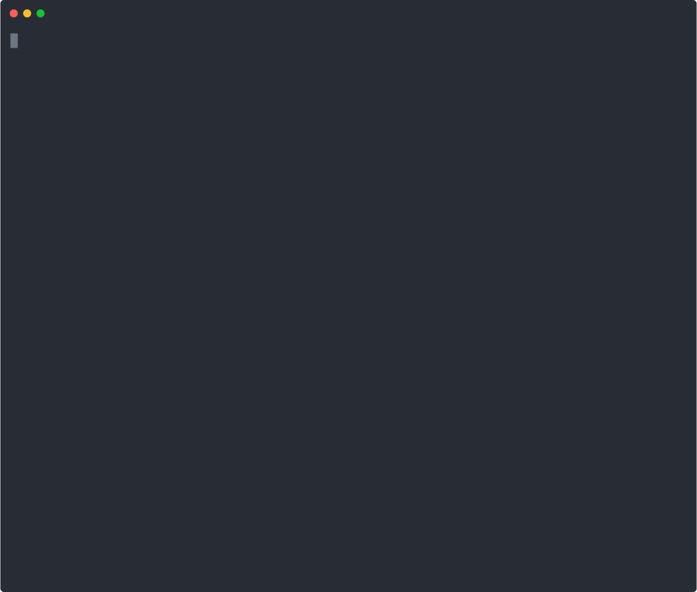

# memlint

[](https://pypi.org/project/memlint/)
[](https://pypi.org/project/memlint/)
[](https://github.com/Bhavye2003Developer/memlint/blob/main/LICENSE)

**Lint your LLM agent's memory before it lies to you.**



`memlint` detects stale facts in an LLM agent's memory store before they are injected into the context window. It scores each fact by age, confirmation history, and contradiction signals, then tells you which ones to flag, refresh, or discard.

Works with **RAG pipelines**, **vector databases** (Pinecone, Qdrant, Chroma, Weaviate, pgvector), **LangChain**, **LangGraph**, **Mem0**, and any agent framework that retrieves memory before prompting.

## The problem

LLM agents that work across sessions store facts about the user and world - where they live, where they work, what they're building. These facts go stale when the real world changes but the memory doesn't. A fact like `"User works at xyz"` stays in memory after a job change. The agent retrieves it, injects it, and answers confidently with wrong information.

`memlint` catches this before it happens.

## Why not just use recency ranking?

Recency ranking softly downranks older memories at retrieval time. It does not tell you which specific facts are wrong or why. A 2-year-old identity fact (`"name is X"`) should stay; a 3-month-old employment fact (`"works at xyz"`) might already be wrong.

`memlint` scores by **fact type**, not just age, because a location changes on a different timescale than a project dependency, which changes on a different timescale than a name. It also detects **contradictions** (two facts about the same topic where a newer one exists) and **confirmation signals** (facts the user has re-stated recently are less likely to be stale).

Recency ranking is retrieval optimization. `memlint` is memory auditing. They solve different problems.

## Installation

```bash
pip install memlint
```

With optional LLM-assisted classification:

```bash
pip install memlint[llm]
```

`memlint[llm]` installs `langchain-core` and `langchain-openai`. For other backends, install the relevant LangChain integration separately:

```bash
pip install langchain-anthropic      # Anthropic Claude
pip install langchain-nvidia-ai-endpoints  # NVIDIA NIM
pip install langchain-ollama         # Ollama (local models)
pip install langchain-aws            # AWS Bedrock
pip install langchain-google-vertexai  # Google Vertex AI
```

Any object with an `invoke()` or `ainvoke()` method works. No LangChain dependency required.

## Quick Start

```python
from memlint import StaleDetector
from memlint.adapters.json_adapter import load_from_json

facts = load_from_json("sample_memories.json")
detector = StaleDetector()
report = detector.check(facts)

print(f"Total: {report.total_facts} | Flagged: {len(report.flagged)}")
for result in report.flagged:
    print(f"  [{result.staleness_level.value.upper()}] {result.content}")
    print(f"    Reason: {result.reason}")
    print(f"    Action: {result.recommendation}")
```

## CLI Usage

Check all facts:
```bash
memlint check memories.json
```

Show only stale and expired:
```bash
memlint check memories.json --only-flagged
```

Output raw JSON:
```bash
memlint check memories.json --json
```

Parse Mem0 format:
```bash
memlint check memories.json --format mem0
```

Sample output:
```
╭──────────┬────────────────────────────────────────┬────────────┬─────┬───────┬─────────┬─────────╮
│ ID       │ Content                                │ Category   │ Age │ Score │ Level   │ Action  │
├──────────┼────────────────────────────────────────┼────────────┼─────┼───────┼─────────┼─────────┤
│ mem_004  │ User works at XYZ as a senior cons...  │ employment │ 279 │  0.70 │ STALE   │ flag    │
│ mem_006  │ User debugged a LangGraph memory is... │ episodic   │  29 │  1.00 │ EXPIRED │ discard │
╰──────────┴────────────────────────────────────────┴────────────┴─────┴───────┴─────────┴─────────╯

Checked 8 facts: 1 fresh, 2 aging, 3 stale, 2 expired
```

## Staleness Score Explained

Each fact is assigned a category with a natural lifespan:

| Category     | Examples                              | Typical Valid Window |
|--------------|---------------------------------------|----------------------|
| `location`   | "lives in Delhi", "office in Sector 5"| 6–24 months          |
| `employment` | "works at xyz", "role is consultant"  | 6–18 months          |
| `project`    | "building pract-agents", "using Pinecone" | 1–6 months       |
| `preference` | "prefers Python", "uses dark mode"    | 3–12 months          |
| `relationship`| "manager is X", "team has 5 people" | 3–12 months          |
| `identity`   | "name is X", "speaks Hindi"           | Very long/permanent  |
| `episodic`   | "debugged a LangGraph issue today"    | Days to weeks        |
| `system_fact`| "Python version is 3.10", "npm v9"   | 1–3 months           |

Score thresholds:
- `0.0 – 0.29` → **FRESH** (safe to use)
- `0.30 – 0.59` → **AGING** (use with caution)
- `0.60 – 0.79` → **STALE** (flag before injecting)
- `0.80 – 1.0` → **EXPIRED** (do not inject without reconfirmation)

## Adapters

**JSON**: default format:
```python
from memlint.adapters.json_adapter import load_from_json
facts = load_from_json("memories.json")
```

**Mem0**: maps `memory` to `content`, `updated_at` to `last_confirmed_at`:
```python
from memlint.adapters.mem0_adapter import load_from_mem0
facts = load_from_mem0("mem0_export.json")
```

**LangChain**: two tools: `check_memory_staleness` and `filter_stale_memories` (see below).

## LangChain / LangGraph Integration

```python
from memlint.adapters.langchain_tool import (
    check_memory_staleness,
    filter_stale_memories,
)

# In a LangGraph node: filter before injecting memories into the LLM
safe_facts_json = filter_stale_memories.invoke({"facts_json": memories_json_string})
```

Requires `pip install memlint[llm]`.

## RAG and Vector DB Integration

Drop `memlint` between your vector DB retrieval step and context injection. Works with any store that returns documents with a timestamp in metadata.

```python
from memlint import StaleDetector, MemoryFact, create_memory_metadata

# At embedding time, generate metadata and store it alongside your vector
metadata = create_memory_metadata(created_at=datetime.utcnow())
collection.upsert(id="mem_001", vector=embedding, metadata=metadata)

# At retrieval time, load directly into MemoryFact
detector = StaleDetector()
results = collection.query(query_texts=[user_query], n_results=10)

facts = [
    MemoryFact(id=doc["id"], content=doc["text"], **doc["metadata"])
    for doc in results
]

# only inject facts that are still fresh
safe = detector.filter_safe(facts)
context = "\n".join(f.content for f in safe)
```

Async version for async RAG chains:

```python
safe = await detector.filter_safe_async(facts)
```

Works with any LLM backend for optional classification: OpenAI, Anthropic, NVIDIA NIM, Ollama, AWS Bedrock, or any object with an `invoke()` / `ainvoke()` method.

## Reconfirming Facts

When a user re-states a fact, confirm it to reset its decay clock:

```python
from memlint import confirm_fact, confirm_facts

# single fact
updated = confirm_fact(fact)

# batch
updated_facts = confirm_facts(facts)

# store updated facts back to your DB
for f in updated_facts:
    collection.update(id=f.id, metadata={"confirmation_count": f.confirmation_count,
                                          "last_confirmed_at": f.last_confirmed_at.isoformat()})
```

`confirm_fact` returns a new fact. It never mutates the original.

## Exporting Scores Back to Your DB

After running a check, write staleness scores back into your vector metadata so you can filter at query time:

```python
report = detector.check(facts)

for entry in report.export_scores():
    # entry has: fact_id, memlint_score, memlint_level, memlint_age_days, memlint_checked_at
    collection.update(id=entry["fact_id"], metadata=entry)

# next time, pre-filter at query level before even loading into Python
results = collection.query(
    query_texts=[user_query],
    where={"memlint_level": {"$nin": ["stale", "expired"]}},
)
```

## Contributing

Open an issue or pull request at https://github.com/Bhavye2003Developer/memlint. See [CONTRIBUTING.md](CONTRIBUTING.md) for details.

## License

MIT License - see [LICENSE](LICENSE) for details.

Copyright (c) 2026 MatrixEscaper
